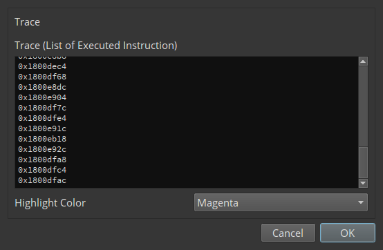
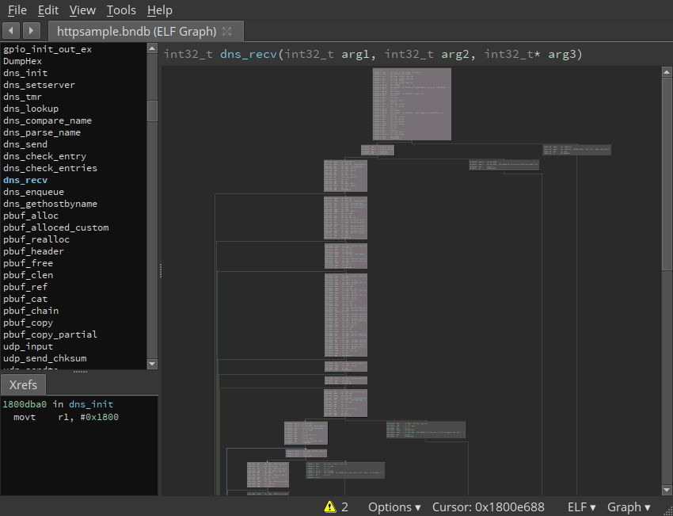

# Trace Highlighter (v1.0 alpha)
Author: **Tomori Nao (@K_atc)**

Highlights _'trace'_ that is listed as executed instruction address.

## Description:

## Minimum Version

This plugin requires the following minimum version of Binary Ninja:

 * release - 9999
 * dev - 1.0.dev-576

## Required Dependencies

The following dependencies are required for this plugin:

 * pip - array, of, pip, dependencies
 * installers - https://bogus-domain/this-package.exe
 * other - The sample plugin requires [this random package](https://bogus-domain/this-package/) be installed.
 * apt - apt, packages

## License

This plugin is released under a [MIT](LICENSE) license.

